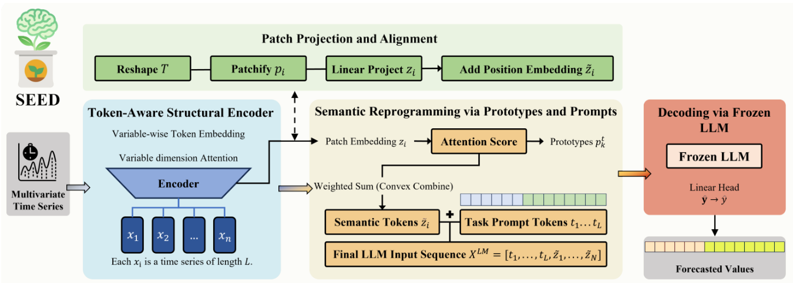

# SEED: A Structural Encoder for Embedding-Driven Decoding in Time Series Prediction with LLMs


<p align="center">
  <strong>
    <a href="https://uosfz.github.io/UOSFZ/">Fengze Li</a>,
    Yue Wang,
    <a href="https://YangleLiu.github.io/">Yangle Liu</a>,
    Ming Huang,
    Dou Hong,
    <a href="https://scholar.xjtlu.edu.cn/en/persons/JiemingMa/">Jieming Ma</a>
  </strong>
</p>

<p align="center">
  <strong>
    IEEE International Conference on Big Data and Artificial Intelligence (BDAI),<br>
    Suzhou, China, 2025 · <span style="color:#d73a49;">Oral Session</span>
  </strong>
</p>


<p align="center">
  || <a href="https://arxiv.org/pdf/2506.20167">Paper</a>
  || <a href="https://arxiv.org/abs/2506.20167">arXiv</a> ||
</p>

<p align="center">
  
</p>


---

## 🔍 Highlights

- ✅ **Structural encoder for multivariate time series** that explicitly models inter-variable dependencies  
- ✅ **Embedding-driven decoding framework** that bridges numerical time series and frozen LLMs  
- ✅ **Semantic reprogramming mechanism** enabling task-aware semantic reasoning  
- ✅ **Decoupled architecture** separating representation learning from semantic inference  
- ✅ **Consistent performance gains** across multiple time series forecasting benchmarks  

---

## 🧾 Abstract

<div style="max-width: 800px; margin: auto; font-size: 0.9em;">

Multivariate time series forecasting requires models to capture both structural dependencies among variables and semantic patterns that generalize across tasks. Traditional structural encoders effectively model correlations but lack semantic reasoning capabilities, while large language models (LLMs) excel at semantic understanding yet cannot directly process numerical time series.

To bridge this gap, we propose **SEED**, a *Structural Encoder for Embedding-Driven Decoding*, which integrates structured representation learning with semantic reasoning powered by frozen LLMs. SEED adopts a modular pipeline consisting of four stages: (1) a token-aware structural encoder that extracts patch-level representations from time series, (2) a projection module that aligns numerical features with the LLM embedding space, (3) a semantic reprogramming mechanism that constructs task-aware semantic prototypes, and (4) an LLM-based decoder that performs prediction without parameter fine-tuning.

This decoupled design enables effective alignment between numerical patterns and semantic reasoning, allowing LLMs to contribute predictive power while preserving structured temporal representations. Extensive experiments on multivariate time series benchmarks demonstrate that SEED consistently outperforms strong baselines, validating the effectiveness of embedding-driven decoding for time series prediction.

</div>

---

## 🔗 Links

- 📄 **arXiv Paper:** [arXiv:2506.20167](https://arxiv.org/abs/2506.20167)

---


## Overview

- Structural dependency modeling for multivariate time series  
- Semantic alignment between numerical patterns and LLM embeddings  
- Task-aware semantic reprogramming  
- Frozen LLM decoding for efficient and generalizable prediction  

---

## TODO list:
- [ ] update the arxiv link
- [ ] release the preprocessed dataset and the pretrained model
- [ ] release more preprocessed dataset and the pretrained model (coming soon)
- [ ] release the codes and instructions of the project

## 📜 Citation

If you find this work useful, please consider citing:

```bibtex
@article{li2025seed,
  title={SEED: A Structural Encoder for Embedding-Driven Decoding in Time Series Prediction with LLMs},
  author={Li, Fengze and Wang, Yue and Liu, Yangle and Huang, Ming and Hong, Dou and Ma, Jieming},
  journal={arXiv preprint arXiv:2506.20167},
  doi={https://doi.org/10.48550/arXiv.2506.20167},
  year={2025}
}


